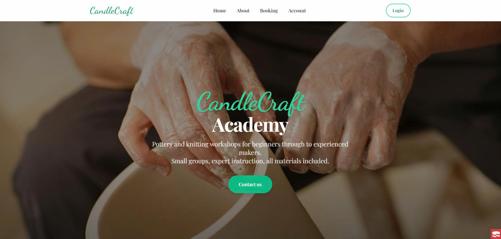
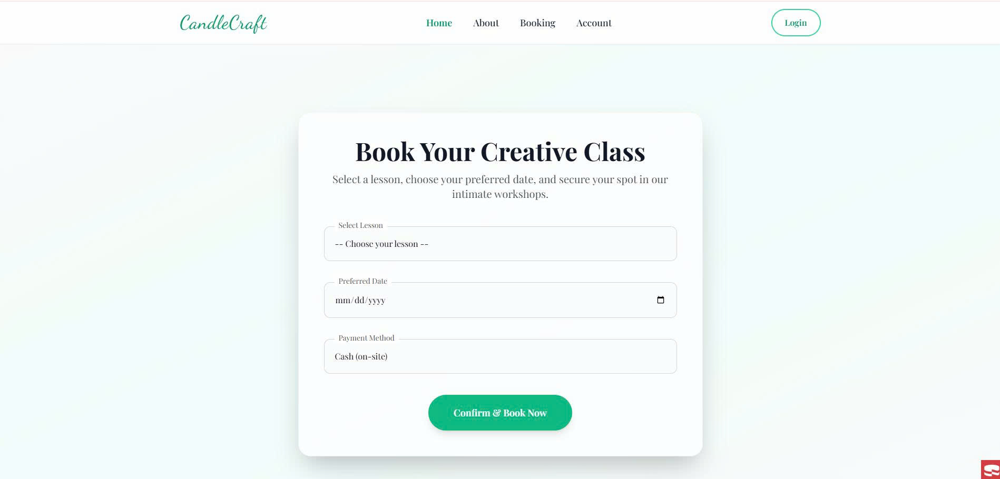
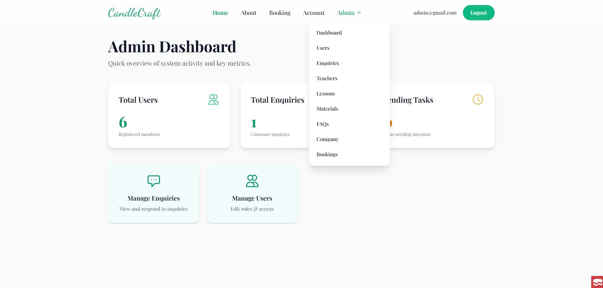

# 🎨 CandleCraft Academy

A web application built using **CakePHP 5** for managing creative workshops such as pottery and knitting.

The system supports:

* 👤 Customers: register, login, booking
* 🛠 Admin: manage system (users, lessons, enquiries, etc.)

---

## 📸 Screenshots


### 🏠 Home Page



### 📅 Booking Page



### 🛠 Admin Dashboard



---

## 🚀 Features

### 👤 Customer

* Register / Login
* Update profile
* Book lessons
* View booking history
* Send enquiries

### 🛠 Admin

* Dashboard overview
* Manage users
* Manage enquiries
* Manage teachers
* Manage lessons
* Manage materials
* Manage FAQs
* Manage company info

### 💳 Booking & Payment

* Prevent duplicate booking
* Auto create payment record
* Track payment status

---

## 🧱 Tech Stack

* **Framework:** CakePHP 5
* **Language:** PHP
* **Database:** MySQL
* **Frontend:** HTML, CSS, JS
* **Authentication:** CakePHP Authentication

---

## ⚙️ Setup & Installation

### 1. Clone repository

```bash
git clone <your-repo-url>
cd your-project
```

---

### 2. Install dependencies

```bash
composer install
```

---

### 3. Configure database

Open:

```bash
config/app_local.php
```

Edit:

```php
'Datasources' => [
    'default' => [
        'host' => 'localhost',
        'username' => 'root',
        'password' => '',
        'database' => 'candlecraft',
        'encoding' => 'utf8mb4',
        'timezone' => 'UTC',
    ],
]
```

---

### 4. Create database

```sql
CREATE DATABASE candlecraft;
```

Then import your SQL file:

```bash
# using phpMyAdmin or MySQL CLI
```

---

### 5. Run server

```bash
bin/cake server
```

Open:

```
http://localhost:8765
```

---

### (Optional) Run over HTTPS (removes “Not secure” in Chrome)

Browsers show “Not secure” on plain HTTP. For local HTTPS, keep Cake running on `http://localhost:8765` and run an HTTPS reverse proxy on `https://localhost:8766`.

Install tools (macOS):

```bash
brew install mkcert nss caddy
```

In another terminal:

```bash
./scripts/dev-https.sh
```

Then open:

```
https://localhost:8766
```

---

## 🔐 Admin Account

Create manually:

```sql
INSERT INTO users (email, password, role)
VALUES ('admin@gmail.com', 'HASHED_PASSWORD', 'admin');
```

> ⚠️ Password must be hashed using CakePHP

---

## 🗂 Project Structure

```
src/
 ├── Controller/
 │    ├── PagesController.php
 │    ├── UsersController.php
 │    ├── BookingsController.php
 │    ├── AdminController.php
 │
 ├── Model/
 │    ├── Table/
 │    ├── Entity/
 │
templates/
 ├── Pages/
 ├── Admin/
 ├── layout/
```

---

## 🧠 System Design

Main entities:

* Users (Customer + Admin)
* Bookings
* Payments
* Lessons
* Teachers
* Materials
* Enquiries
* Company Info
* FAQs

---

## 👥 Developer

| Name           | Role      |
| -------------- | --------- |
| Ngô Duy Khánh  | Developer |

---


## 📈 Future Improvements

* Online payment (Stripe / PayPal)
* Booking calendar
* Email notification
* Mobile UI optimization

---

## 📄 Notes

This project is developed for academic purposes.


